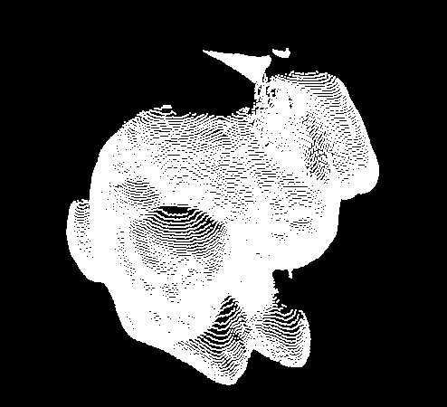
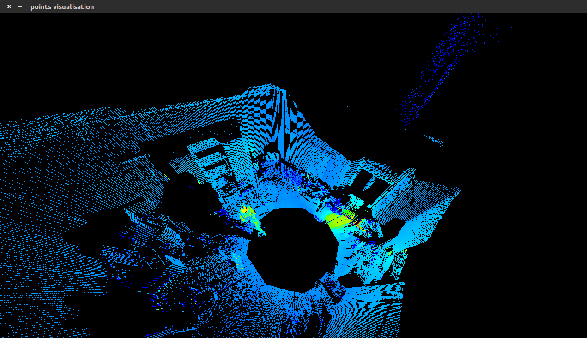
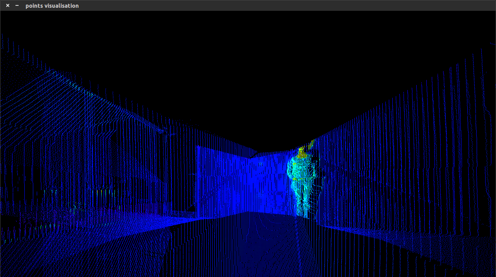

# yutu



point cloud representations and movements

# quick setup

```Bash
git clone https://github.com/vispy/vispy.git
cd vispy
sudo python setup.py install
```

```Bash
sudo apt-get -y install python-pygame
git clone https://github.com/wdbm/yutu.git
cd yutu
python example_1.py
```

# data




Data by Dorit Borrmann and Hassan Afzal of Jacobs University Bremen gGmbH was provided by the [Robotic 3D Scan Repository](http://kos.informatik.uni-osnabrueck.de/3Dscans/). The data were recorded at the Automation Lab at Jacobs University Bremen using a Riegl VZ-400 laser scanner and an Optris PI infrared camera. Thermal data is encoded as colour.

# future

Under consideration are rigid body movement matrices and perspective projection data cuts.
